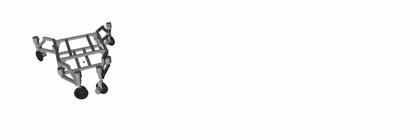

# Swerve MPC


Code for the RA-L and IROS publication "Design and Motion Planning for a Reconfigurable Robotic Base".

The full text of the paper is on [IEEE Xplore](https://ieeexplore.ieee.org/document/9817632).

You can find the accepted version on [arxiv](https://arxiv.org/abs/2206.15298).

Bibtex snippet to cite our work:

```
@article{pankertDesignMotionPlanning2022,
	title = {Design and {Motion} {Planning} for a {Reconfigurable} {Robotic} {Base}},
	volume = {7},
	issn = {2377-3766},
	doi = {10.1109/LRA.2022.3189166},
	number = {4},
	journal = {IEEE Robotics and Automation Letters},
	author = {Pankert, Johannes and Valsecchi, Giorgio and Baret, Davide and Zehnder, Jon and Pietrasik, Lukasz L. and Bjelonic, Marko and Hutter, Marco},
	month = oct,
	year = {2022},
	note = {Conference Name: IEEE Robotics and Automation Letters},
	keywords = {Legged locomotion, Manipulators, Mechanism design, mobile manipulation, Navigation, Planning, robotics and automation in construction, Robots, Task analysis, Wheels, whole-body motion planning and control},
	pages = {9012--9019}
}
```

Videos of the hardware experiments are on [youtube](https://youtu.be/qBY4zovf2vo).

## Docker
The easiest way to run a demo on your local machine is to use docker.
Fetch the image from dockerhub with:
```
docker pull rslethz/swerve_mpc
```
Alternatively, build a docker image by cloning this repository and running the following command:
```
docker image build -t rslethz/swerve_mpc .
```
Run the simulation with this command:
```
xhost local:root &&\
docker container run -it --rm --name swerve_simulation_demo \
 -e DISPLAY=$DISPLAY \
 -v /tmp/.X11-unix:/tmp/.X11-unix \
 --device /dev/dri \
 rslethz/swerve_mpc /bin/bash -c "source devel/setup.bash && roslaunch swerve_control simulation.launch"
```
If a joystick is connected to the port `/dev/input/js0`, you can give the container access to it:
```
xhost local:root &&\
docker container run -it --rm --name swerve_simulation_demo \
 -e DISPLAY=$DISPLAY \
 -v /tmp/.X11-unix:/tmp/.X11-unix \
 --device /dev/dri --device /dev/input/js0 \
 rslethz/swerve_mpc /bin/bash -c "source devel/setup.bash && roslaunch swerve_control simulation.launch"
```
 
The reconfiguration scripts can be called as follows:
```
docker exec swerve_simulation_demo /bin/bash -c "source devel/setup.bash && rosrun swerve_mpc x_open.py"
```

## Local Installation
The code has been tested with Ubuntu 20.04 and ros-noetic.
Install the following tools to fetch the dependencies:
```
sudo apt install python3-catkin-tools python3-rosdep git python3-vcstool
```

Create a new catkin workspace and clone this repo into the src dir.

Clone all source dependencies into the src dir with vcstool:
```
vcs import . < ../dependencies_exact.rosinstall --recursive --shallow
```

Use rosdep to install all binary dependencies:
```
rosdep update && rosdep install --from-paths . --ignore-src -r -y
```

Compile all packages with:
```
catkin build swerve_control
```

### Gazebo Simulation
To launch in simulation, run:
```
roslaunch swerve_control simulation.launch
```
By default, the gazebo simulator starts with an empty world. In `swerve_description/launch/gazebo.launch`, the world file can be specified. We provide the file `slope.world` to test the SE3 motion model of the MPC. For deployments on slopes, the state estimator can be activated by setting the argument `use_state_estimator` in `swerve_control/launch/highlevel_controller.launch` to true.

The MPC ros controller can be activated with the `rqt_controller_manager` GUI. Navigation commands can be send to the robot with the `rviz` goal pose marker or a joystick.
Reconfiguration can be triggered with the rosservice `/swerve_base/brakes_service` or the following scripts:
```
rosrun swerve_mpc x_open.py
rosrun swerve_mpc x_close.py
rosrun swerve_mpc h_open.py
rosrun swerve_mpc h_close.py
rosrun swerve_mpc a_open.py
rosrun swerve_mpc a_close.py
```
The `open` scripts open the brakes and allow for reconfiguration. The `close` scripts fix the base at the current configuration. Please note that a navigation goal needs to be sent while reconfiguring.

## Packages
### Controllers
#### swerve_mpc
Swerve MPC module and a `ros_control` tracking controller implementation.
### Support
#### swerve_control
Launch files to start the simulation. 

#### strafe_joy
Fork of turtle_teleop_joy including a new axis for strafing.

#### swerve_description
Robot description files specific to swerve.

#### swerve_msgs
Message definitions for steering controllers and brakes

#### swerve_brakes
Contains code for controlling magnetic brakes and reading brake encoders with a micro controller

## License
BSD-3-Clause
Copyright (c) 2022 Johannes Pankert <pankertj@ethz.ch>, Davide Baret, Lukasz Pietrasik
All rights reserved.

Redistribution and use in source and binary forms, with or without
modification, are permitted provided that the following conditions are met:

1. Redistributions of source code must retain the above copyright notice,
   this list of conditions and the following disclaimer.
2. Redistributions in binary form must reproduce the above copyright
   notice, this list of conditions and the following disclaimer in the
   documentation and/or other materials provided with the distribution.
3. Neither the name of this work nor the names of its
   contributors may be used to endorse or promote products derived from
   this software without specific prior written permission.

THIS SOFTWARE IS PROVIDED BY THE COPYRIGHT HOLDERS AND CONTRIBUTORS "AS IS"
AND ANY EXPRESS OR IMPLIED WARRANTIES, INCLUDING, BUT NOT LIMITED TO, THE
IMPLIED WARRANTIES OF MERCHANTABILITY AND FITNESS FOR A PARTICULAR PURPOSE
ARE DISCLAIMED. IN NO EVENT SHALL THE COPYRIGHT OWNER OR CONTRIBUTORS BE
LIABLE FOR ANY DIRECT, INDIRECT, INCIDENTAL, SPECIAL, EXEMPLARY, OR
CONSEQUENTIAL DAMAGES (INCLUDING, BUT NOT LIMITED TO, PROCUREMENT OF
SUBSTITUTE GOODS OR SERVICES; LOSS OF USE, DATA, OR PROFITS; OR BUSINESS
INTERRUPTION) HOWEVER CAUSED AND ON ANY THEORY OF LIABILITY, WHETHER IN
CONTRACT, STRICT LIABILITY, OR TORT (INCLUDING NEGLIGENCE OR OTHERWISE)
ARISING IN ANY WAY OUT OF THE USE OF THIS SOFTWARE, EVEN IF ADVISED OF THE
POSSIBILITY OF SUCH DAMAGE.

